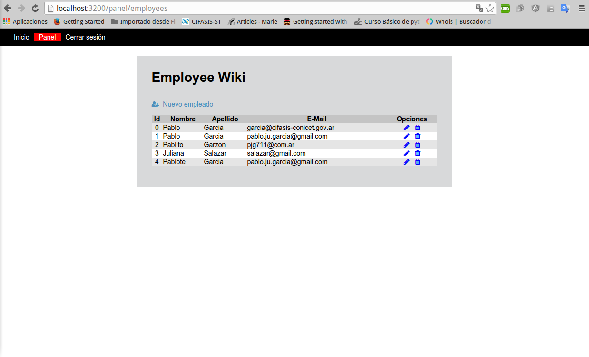

Trabajo final del curso NodeJS año 2016
=======================================

Alta, Baja y Modificaciones de Empleados usando NodeJS, Express, MongoDB y Jade.
Busqueda de empleados
Listado de empleados

Instalación
-----------

```
git clone https://github.com/pjg711/trabajo-final-nodejs.git
cd trabajo-final-nodejs
npm install
bower install

# iniciar servidor 
npm start

# abrir en un navegador
http://localhost:3200
```

Login
-----


Inicio
------


Presentación de la busqueda de empleados
----------------------------------------


Panel
-----


